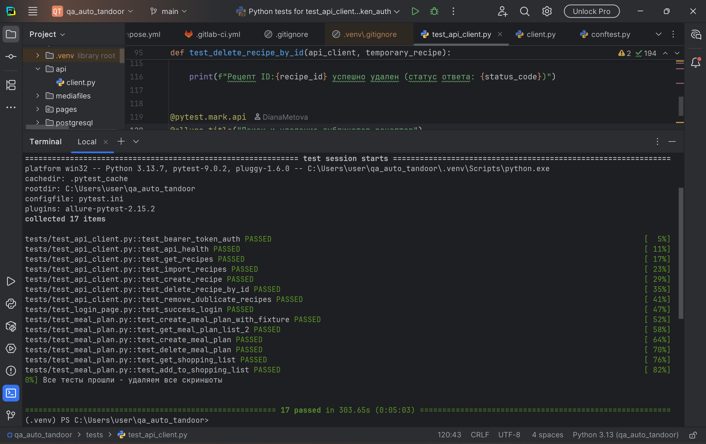

# Дипломный проект: автоматизация smoke-тестирования раздела Meal Plan веб-приложения Tandoor

[](https://github.com/Diana25T/QA_FinalProject_Metova__DS/actions)

**Студент:** Диана  
**Курс:** Тестировщик ПО  
**Образовательная платформа:** EdusonAcademy

---

##  Описание проекта

Проект представляет собой фреймворк для автоматизации smoke-тестирования раздела Meal Plan веб-приложения Tandoor, которое позволяет управлять рецептами и планировать питание.

**Реализовано тестирование:**
-  через REST API
-  через пользовательский интерфейс (Selenium WebDriver)
-  с использованием паттерна Page Object Model

**Важное замечание** для проверки:Этот проект реализует smoke-тесты для проверки ключевой функциональности раздела Meal Plan. Для их выполнения требуется подключение к работающему бэкенду (серверу приложения).

При запуске на вашем компьютере без настроенного окружения тесты закономерно завершатся ошибкой подключения. Это не ошибка в коде, а штатное поведение, подтверждающее, что тесты корректно настроены на проверку реального сервера.

Для демонстрации работоспособности я предоставляю два варианта:

Успешный запуск в CI/CD: Демонстрационный пайплайн в GitHub Actions, который показывает структуру проекта и проходит успешно без необходимости VPN. Это подтверждает качество кода.
Локальный запуск с Docker: Проект можно запустить локально на localhost вместе с его окружением (приложением и базой данных) с помощью Docker Compose. Инструкция находится ниже.

---

##  GitHub Actions — демонстрация CI/CD

В проекте настроен автоматический пайплайн, демонстрирующий навыки работы с CI/CD.

###  Что делает пайплайн:

-  **Анализирует структуру** тестового фреймворка
-  **Проверяет синтаксис** Python-файлов
-  **Показывает статистику** тестов
-  **Интегрирует скриншоты** локального выполнения

###  Ссылки:

- ** Статус пайплайна:** [GitHub Actions](https://github.com/Diana25T/QA_FinalProject_Metova__DS/actions)
- ** Конфигурация:** [`.github/workflows/demo.yml`](https://github.com/Diana25T/QA_FinalProject_Metova__DS/blob/main/.github/workflows/demo.yml)

---

##  Результаты локального тестирования



* 17 тестов успешно пройдены за 303.65s (0:05:03)*

*Тесты выполнялись локально с доступом к тестовому окружению через VPN.*

---

##  Цели проекта

- Проверка ключевых пользовательских сценариев раздела Meal Plan
- Обеспечение стабильности работы функциональности
- Интеграция тестирования в процесс CI/CD (демо-версия)

---

##  Технологический стек

- **Python 3.13** — язык программирования
- **Pytest** — фреймворк тестирования
- **Requests** — HTTP-запросы к API
- **Selenium WebDriver** — автоматизация браузера
- **Allure** — генерация отчётов
- **GitHub Actions** — демонстрационный CI/CD пайплайн
- **Docker** — контейнеризация окружения

---

##  Структура проекта
QA_FinalProject_Metova__DS/

```
project/
├── api/
│   └── client.py               # Клиент для работы с API Tandoor
├── pages/                      # Page Objects для UI тестов
│   ├── __init__.py
│   ├── base_page.py           # Базовый класс страницы
│   ├── login_page.py          # Страница авторизации
│   ├── meal_plan_page.py      # Страница планов питания
│   ├── shopping_list_page.py  # Страница списка покупок
│   └── components/
│       └── header.py          # Компонент шапки
├── tests/                      # Тесты
│   ├── conftest.py            # Конфигурация и фикстуры Pytest
│   ├── test_api.py            # API тесты
│   ├── test_ui.py             # UI тесты
│   └── test_login.py          # Тесты авторизации
├── test_data/                  # Тестовые данные
│   ├── recipe_links.json      # Ссылки для импорта рецептов
│   └── imported_recipes.json  # Кеш импортированных рецептов
├── .env.example               # Пример файла с переменными окружения
├── .gitlab-ci.yml             # Конфигурация CI/CD
├── requirements.txt           # Зависимости Python
├── README.md                  # Эта документация
└── pytest.ini                # Конфигурация Pytest
```

##  Реализованные сценарии тестирования

### API тесты:

1. **Аутентификация** - проверка Bearer Token авторизации
2. **Рецепты** - создание, получение, импорт и удаление рецептов
3. **Планы питания** - полный цикл CRUD операций
4. **Списки покупок** — добавление/удаление
5. **Поиск дубликатов** - автоматическое обнаружение и удаление дублей

### UI тесты:

1. **Авторизация** - проверка успешного входа в систему
2. **Создание планов питания** — через интерфейс
3. **Удаление планов** — с подтверждением через API
4. **Интеграция с корзиной** - автоматическое добавление продуктов при создании планов
5. **Навигация** — проверка элементов интерфейса

---

## Установка и запуск

### Быстрый запуск (без Docker)
Этот способ позволяет проверить установку зависимостей и структуру проекта.

1.  **Клонирование репозитория:**
    ```bash
    git clone https://github.com/Diana25T/QA_FinalProject_Metova__DS.git
    cd QA_FinalProject_Metova__DS
    ```
2.  **Настройка виртуального окружения:**
    ```bash
    python -m venv venv

    # Windows:
    venv\Scripts\activate
    # Linux/Mac:
    source venv/bin/activate
    ```
3.  **Установка зависимостей:**
    ```bash
    pip install -r requirements.txt
    ```
4.  **Настройка переменных окружения:**
    Создайте файл `.env` на основе примера:
    ```bash
    cp .env.example .env
    ```
5.  **Запуск тестов:**
    ```bash
    # Все тесты
    pytest tests/ -v

    # API тесты
    pytest tests/ -m api -v

    # UI тесты
    pytest tests/ -m ui -v
    ```

### Полный запуск окружения (с Docker)
Проект полностью готов к запуску в изолированном окружении с помощью Docker Compose..

Важное замечание: Для полной демонстрации прохождения тестов требуется настроенный бэкенд. Проект настроен на работу с публичным образом приложения (vabene1111/recipes) в соответствии с официальной документацией.

Предварительные требования: Установлен Docker Desktop.

Инструкция по запуску:

Настройка переменных:В репозитории лежит пример файла конфигурации — .env.example Скопируй его и заполни секретные ключи:
bash
```
cp .env.example .env
```
В файле необходимо заменить значения SECRET_KEY, POSTGRES_PASSWORD и другие на свои собственные.
Запуск контейнеров:Запусти приложение и базу данных в фоновом режиме:
bash
```
docker compose up -d
```
Подожди 1-2 минуты, пока контейнеры загрузятся и база данных инициализируется.
Запуск тестов:Активируй виртуальное окружение Python и выполни тесты:
bash
```
source venv/bin/activate  # или .\venv\Scripts\activate на Windows
pytest tests/ -v --alluredir=allure-results
```
Просмотр отчета (опционально):
bash
```
allure serve allure-results
```

##  Устранение неполадок

| Проблема | Решение |
|----------|---------|
|Ошибка cannot find Chrome binary |	Установите браузер Google Chrome на свой компьютер|
|Ошибка HTTPConnectionPool: Connection refused | Это ожидаемое поведение. Тесты пытаются подключиться к серверу, к которому нет доступа|
| **401 Unauthorized** | Проверьте правильность токена в переменной `TANDOOR_TOKEN` |
| **Таймауты UI-тестов** | Увеличьте время ожидания в `conftest.py` или проверьте доступность Tandoor |
| **ModuleNotFoundError** | Запускайте тесты из корневой директории проекта |
| **ChromeDriver не найден** | Установите `webdriver-manager`: `pip install webdriver-manager` |
| **Allure reports не генерируются** | Убедитесь, что установлен allure-pytest и Java |

---

##  Контакты

**GitHub:** [@Diana25T](https://github.com/Diana25T)  
**Репозиторий:** [QA_FinalProject_Metova__DS](https://github.com/Diana25T/QA_FinalProject_Metova__DS)

---

